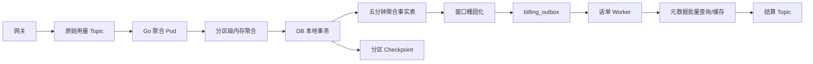
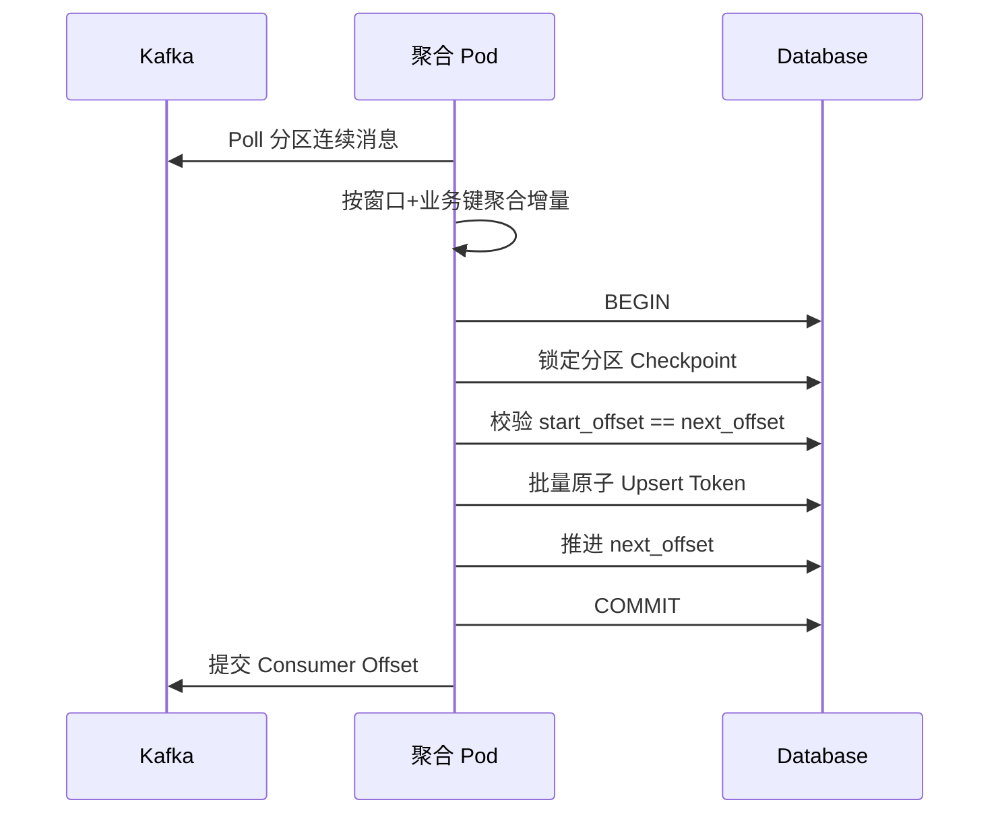
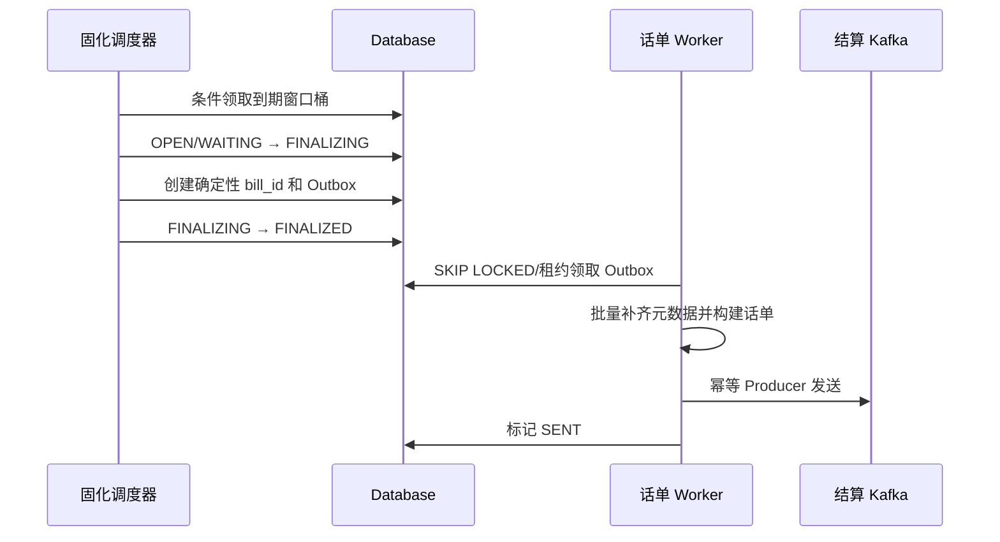
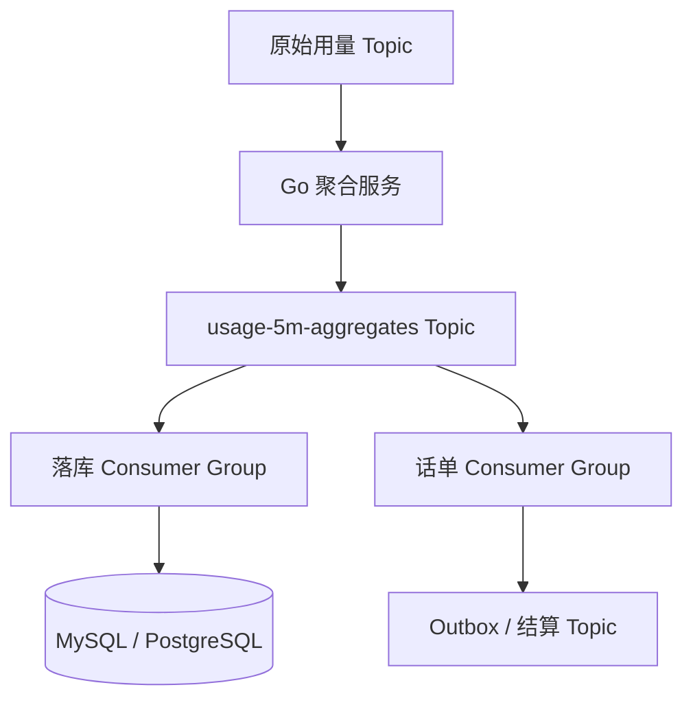

# 目标架构与数据流

## 1. 近期目标架构



近期不要求增加新的流处理平台。计算、持久化和上报仍由 Go 服务完成。

## 2. 原始事件到数据库的时序



数据库 Checkpoint 是已完成计费累计的权威进度。Kafka Offset 用于快速恢复，但不能越过数据库进度。

## 3. 窗口固化与话单发送



## 4. 固定窗口语义

窗口使用左闭右开区间：

```text
[11:20:00, 11:25:00)
[11:25:00, 11:30:00)
```

- 使用 `occurred_at`，不能使用消费时间。
- 内部统一 UTC。
- 建议窗口结束后保留 2～3 分钟迟到宽限。
- 在 `window_end + grace` 后固化，确保在窗口结束后 5 分钟内上报。

## 5. 中期架构

当数据库故障开始影响原始消费，或准备物理分库时，引入聚合结果 Topic：



收益是聚合、落库和话单生成可独立扩缩容；代价是增加 Topic、消费组、端到端延迟和一致性设计。本阶段必须通过影子链路引入，不作为近期必改项。

## 6. 远期物理分库

现在计算但暂不启用：

```text
virtual_bucket = stable_hash(billing_key) % 256
```

未来可将 256 个虚拟桶映射到 2～4 个物理库，每个库内部仍按日分区。聚合结果 Topic 应按虚拟桶分区，使一个消费分区只写一个目标物理库，避免跨库事务。
