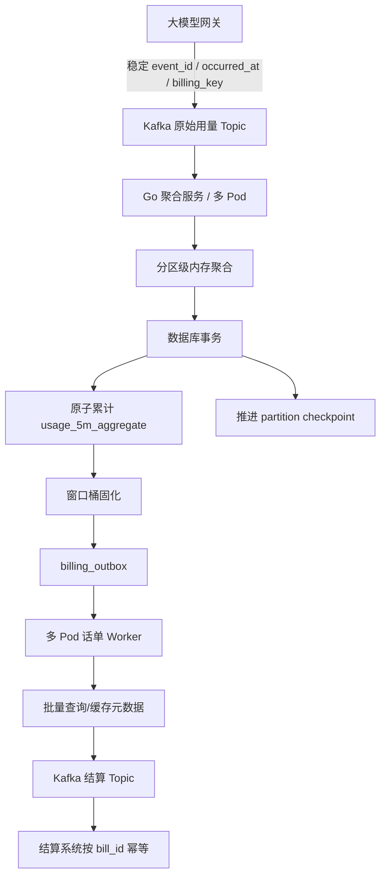

# 大模型网关计费服务性能优化方案

> 适用场景：Go 计费服务、多 Pod、Kafka 消费、MySQL/PostgreSQL 落库、固定 5 分钟用量窗口、Kafka 话单上报。
> 规划目标：从当前约 5,000 QPS 平滑扩展到 50,000 QPS，每个窗口承载 1 万～10 万个唯一聚合键，并保证并发场景下不重复计费、不漏计费。

## 1. 已确认的业务模型

- 网关每次模型调用产生一条用量事件，包含用户、模型、API Key、输入 Token 和输出 Token。
- 计费服务按照自然时钟对齐的固定 5 分钟窗口汇聚。
- 聚合唯一键为 `窗口 + 站点 + 用户 + 模型 + API Key`。
- 唯一键第一次出现时插入数据库，同一窗口内后续事件持续累计到同一行。
- 多个计费 Pod 以同一个 Consumer Group 消费 Kafka。
- 话单在窗口结束后生成，查询元数据并发往结算 Kafka Topic。
- 正常目标是窗口结束后 5 分钟内完成上报。

## 2. 核心判断

暂不引入 Hive、Spark 或 Flink，也不立即实施物理分库。优先使用现有 Go、Kafka、Redis、MySQL/PostgreSQL 完成以下改造：

1. 固定事件时间、窗口和业务键语义。
2. 按 Kafka 分区组织本地聚合状态。
3. 使用数据库分区 Checkpoint 和原子 Upsert 保证多 Pod 并发准确性。
4. 使用窗口桶状态机避免重复固化和累计/固化竞态。
5. 使用 Outbox 解耦聚合落库与话单发送。
6. 通过批量查询、缓存和预热优化元数据访问。
7. 聚合事实表按日原生分区，预留 256 个虚拟桶。
8. Kafka 先压测现有 4 分区，再渐进扩到 8、12 或 16 分区。
9. 达到明确阈值后，再引入聚合结果 Topic 和物理分库。

## 3. 目标架构

## 4. 必须满足的不变量

1. 相同 Kafka Offset 最多累计一次。
2. 数据库未提交成功前不能推进权威 Checkpoint。
3. 多 Pod 并发累计不能发生丢失更新。
4. 同一聚合键在一个窗口中只有一条聚合记录。
5. 同一窗口桶只能由一个 Pod 固化。
6. 固化期间不能遗漏仍在提交的累计数据。
7. 已固化窗口的迟到事件必须进入修正或对账路径。
8. 同一 `bill_id` 即使重复投递，也只能结算一次。
9. 任意 Pod 崩溃或 Rebalance 后都可从持久进度恢复。

## 5. 实施优先级

| 阶段 | 主要内容 | 主要收益 |
|---|---|---|
| P0 | 监控、代码审计、容量基线 | 找到真实瓶颈，避免盲目扩容 |
| P1 | 统一键、DB Checkpoint、原子累计 | 解决多 Pod 重放、丢失更新和漏计 |
| P2 | 窗口桶状态机、Outbox、下游幂等 | 安全固化窗口，可靠发送话单 |
| P3 | 批量刷新、元数据缓存、日分区 | 降低 DB、Redis 和元数据查询压力 |
| P4 | Kafka 4→8→12/16 渐进扩容 | 提升吞吐并控制 Rebalance 风险 |
| P5 | 聚合结果 Topic、物理分库 | 突破单库边界，独立扩展各阶段 |

## 6. 修改收益与风险速览

| 修改点 | 收益 | 主要风险 |
|---|---|---|
| 统一窗口和键 | 窗口归属稳定、分区稳定、可幂等 | 算法切换影响边界数据 |
| 分区级聚合 | 降低锁竞争，支持独立背压 | 本地状态和 Rebalance 更复杂 |
| DB Checkpoint | 重放不重复、崩溃可恢复 | Checkpoint 行锁与事务时延 |
| 原子批量 Upsert | 防止并发丢失更新 | 热点行锁、长事务 |
| 窗口桶状态机 | 多 Pod 安全固化 | 锁顺序、迟到修正复杂 |
| Outbox | 不漏话单、上报可扩展 | 可能重复发送，表需归档 |
| 元数据缓存 | 避免查询尖峰 | 版本和缓存一致性 |
| 日分区事实表 | 降低历史维护成本 | 不提升单实例总写能力 |
| 渐进扩 Kafka 分区 | 提升并行吞吐 | Rebalance、Key 映射变化 |
| 虚拟桶 | 低成本预留分库 | 哈希协议需长期稳定 |

## 7. 文档导航

- [01-现状与容量评估.md](./01-现状与容量评估.md)
- [02-目标架构与数据流.md](./02-目标架构与数据流.md)
- [03-并发一致性方案.md](./03-并发一致性方案.md)
- [04-数据库与分区方案.md](./04-数据库与分区方案.md)
- [05-Kafka与多Pod优化.md](./05-Kafka与多Pod优化.md)
- [06-话单Outbox与元数据优化.md](./06-话单Outbox与元数据优化.md)
- [07-实施路线与回滚方案.md](./07-实施路线与回滚方案.md)
- [08-压测监控与验收清单.md](./08-压测监控与验收清单.md)

## 8. 执行前仍需确认

- Go Kafka 客户端及版本。
- MySQL、PostgreSQL 的具体版本。
- 当前 Offset 提交方式和 Rebalance 回调实现。
- 当前聚合刷新周期、批量大小和数据库 Upsert SQL。
- Redis 去重的 TTL，以及标记与数据库提交的先后顺序。
- Kubernetes 使用 Deployment 还是 StatefulSet。
- 结算系统是否按 `bill_id` 幂等，以及是否支持增补/冲正。
- 影响计费的元数据采用调用时版本还是上报时最新版本。
