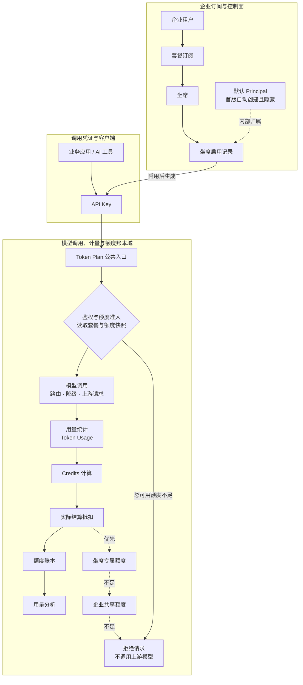
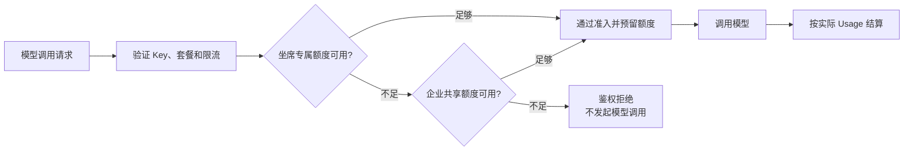

# Token Plan V1 架构图 · V6

> 首版产品只呈现租户、套餐、坐席与 API Key；内部保留默认 Principal 作为归属、审计和未来分账的锚点。

## 总体架构



## 边界说明

| 领域 | 核心职责 |
|---|---|
| 企业订阅与控制面 | 管理套餐、坐席、坐席启用记录以及 Key 生命周期 |
| 调用凭证与客户端 | 业务应用只持有 API Key，不携带成员或 Principal ID |
| 模型调用数据面 | 完成 Key、RPM/TPM、套餐状态及可用额度校验；额度不足时拒绝准入 |
| 计量与账本域 | 采集 Token、换算 Credits、执行抵扣并记录不可变账本 |

## 坐席与 API Key

- 坐席启用后生成 API Key。
- API Key 属于一次坐席启用记录，不直接等同于坐席本身。
- 重置 Key 不改变坐席、额度和历史用量。
- 回收坐席会撤销当前启用记录下的全部 Key。
- 重新启用坐席创建新的启用记录和新 Key。

## 额度与故障域



- Key 的真实性校验通过，不代表调用一定准入；套餐状态、RPM/TPM 和可用额度均为准入条件。
- 专属额度与共享额度都不足时，统一表现为鉴权/准入失败，不发起上游模型调用。
- 单个 Key 的泄露、封禁或限流不应影响其他坐席。
- 调用前预留额度，调用后依据实际 Usage 结算并释放差额。

## 生命周期边界

| 操作 | 套餐 | 坐席启用记录 | API Key |
|---|---|---|---|
| 购买套餐 | 生效 | 尚未创建 | 不生成 |
| 启用坐席 | 不变 | 创建新记录 | 生成新 Key |
| 重置 Key | 不变 | 不变 | 旧 Key 撤销，生成新 Key |
| 暂停坐席 | 不变 | 暂停 | 暂停调用 |
| 回收坐席 | 不变 | 结束当前记录 | 全部撤销 |
| 套餐到期 | 到期 | 冻结 | 无法调用 |
| 重新启用 | 有效 | 创建新记录 | 生成新 Key |

## Principal 的首版处理

```text
对外产品概念：
企业租户 → 套餐 → 坐席 → API Key

内部领域模型：
企业租户 → Default Principal → SeatAssignment → Credential
```

首版系统为每个企业租户自动创建一个默认 Principal：

```text
subject_type = TENANT
display_name = 默认使用主体
```

它不会出现在控制台，也不会进入模型请求协议。未来增加成员、应用、项目或客户分账时，只需要创建新的 Principal，不需要重构坐席、Key、用量记录和额度账本。

为避免架构图出现大量跨区虚线，归属信息在实现中直接作为标识写入：

```text
UsageRecord.seat_assignment_id
UsageRecord.principal_id
LedgerEntry.quota_account_id
```

鉴权节点直接读取额度快照完成调用准入，不再在图中单独绘制“额度池反向连接鉴权节点”的跨区连线。
