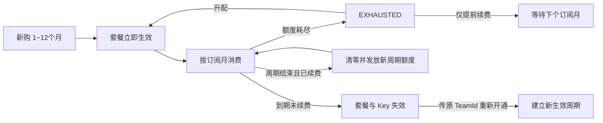
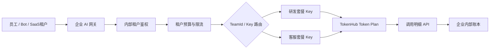

# 腾讯 TokenHub Token Plan 企业版深度调研

> 调研日期：2026-07-21
> 产品范围：大模型服务平台 TokenHub 的 Token Plan 企业版专业套餐、轻享套餐
> 资料标准：仅采用腾讯云官方产品文档、API 文档、数据结构及公告
> 结论标识：✅ 官方明确｜🔎 基于官方接口行为的推断｜❓公开资料未知

---

## 一、结论先行

### 1.1 十个关键判断

1. **腾讯企业版不是坐席制，而是“套餐额度池 + 多 API Key”。** 管理员购买套餐后主动创建 Key，不需要先创建成员，也不存在一成员一坐席一 Key 的强绑定。
2. **企业版分为专业套餐和轻享套餐。** 专业版购买积分池并按模型差异系数扣减；轻享版购买 Token 池，所有输入、缓存和输出 Token 均按 1:1 扣减，但只能调用 Auto。
3. **专业套餐公开刊例价没有 Token 单价折扣。** `100 积分 = 1 元`，将各模型积分价除以 100 后，与 TokenHub 广州地域后付费价格逐项一致。它的核心价值是预算锁定、多 Key 配额和治理，而不是公开价格优惠。
4. **轻享套餐具有真正的简化定价。** 刊例价为 2 元/百万 Token；输出密集、缓存命中率较低时通常比专业 Auto 便宜，高缓存场景可能反而更贵。
5. **多套餐提供真正的预算和生命周期隔离。** 一个主账号可购买多个套餐，每个 `TeamId` 有独立额度池、Key 命名空间、用量统计和到期时间；但是否提供物理吞吐隔离，官方没有承诺。
6. **Key 级治理能力完整。** 可配置模型白名单、独占额度、总额度上限、启停和 TPM；修改即时生效且不改变密钥值。
7. **额度隔离不等于腾讯费用中心分账。** 官方明确预付费资源无法按 API Key 分账；Token Plan 只能通过调用明细做内部成本归因，不能直接形成下游客户账单或发票。
8. **套餐没有超额后付费兜底承诺。** 套餐和 Key 数据结构均存在额度耗尽状态，应按请求被拒绝设计；官方尚未公布耗尽对应的精确推理错误码。
9. **生命周期约束较硬。** 未用额度不结转，不支持降配或退订；提前续费不会给当前已耗尽周期补额度；到期后套餐和 Key 立即失效。
10. **企业版可用于工具、应用和服务 API 调用。** 它没有个人版禁止应用后端的限制；但直接向 SaaS 外部客户分发或转售 Key 的权利边界未公开，需商务和法务确认。

### 1.2 推荐判断

| 需求 | 建议 |
|---|---|
| 只需要低成本 Auto 路由，不要求固定模型 | 轻享套餐 |
| 需要指定模型、Key 级模型白名单、额度和 TPM | 专业套餐 |
| 用量波动大、可能买不满 | 后付费通常财务风险更低 |
| 需要按部门/项目做硬预算隔离 | 每部门/项目独立购买一个企业套餐 |
| 需要按员工/Bot 做软隔离 | 同套餐创建多个 Key，配置独占额度与总上限 |
| 需要腾讯费用中心按 Key 开账 | 企业 Token Plan 无法满足，需要后付费资源或自建账本 |
| 必须使用腾讯混元 Hy3 | 当前企业套餐模型表没有 Hy3，应评估 TokenHub 后付费或商务 SKU |

---

## 二、产品结构与商业模式

### 2.1 资源层级

```text
腾讯云主账号（AppId / Uin）
  ├─ TeamId：研发套餐
  │    ├─ PrepayResourceID：云计费预付费资源
  │    ├─ PackageInfo：本周期主额度池
  │    ├─ API Key A：研发 Agent
  │    └─ API Key B：代码助手
  └─ TeamId：客服套餐
       ├─ PrepayResourceID：另一预付费资源
       ├─ PackageInfo：独立额度池
       └─ API Key C：客服 Bot
```

官方术语含义：

| 字段 | 含义 |
|---|---|
| `TeamId` | Token Plan 企业版套餐 ID，是 TokenHub 控制面主键 |
| `PrepayResourceID` | 套餐绑定的腾讯云计费预付费资源 ID |
| `ProductType=enterprise` | 企业版专业套餐 |
| `ProductType=enterprise-auto` | 企业版轻享套餐 |
| `PackageInfo` | 套餐总额度、周期、独占池和共享池信息 |
| `ApiKeyId` | 套餐内 API Key 的资源 ID |

🔎 从接口结构可推断：`TeamId` 管理模型权限、Key 和额度中心关系；`PrepayResourceID` 用于腾讯云订单及预付费生命周期。调用请求只携带 Bearer Key，网关再反查其所属 `TeamId` 与策略。

### 2.2 专业套餐

| 配置项 | 规则 |
|---|---|
| 计量单位 | 积分 |
| 刊例价 | 1 元/100 积分 |
| 最低规格 | 10 万积分，即 1,000 元/月 |
| 购买时长 | 1～12 个月 |
| API Key 上限 | 每 1 万积分可创建 1 个 Key |
| 模型 | Auto、GLM、Kimi、MiniMax、DeepSeek 等当前模型库 |
| 抵扣 | 按模型、上下文阶梯、缓存输入、普通输入和输出差异扣积分 |

一个账号可购买多个专业或轻享套餐。不同套餐拥有独立额度、API Key、用量统计和到期时间，适合将部门或项目作为一级预算单元。

### 2.3 轻享套餐

| 配置项 | 规则 |
|---|---|
| 计量单位 | Token |
| 刊例价 | 2 元/百万 Token/月 |
| 最低规格 | 5,000 万 Token，即约 100 元/月 |
| 购买时长 | 1～12 个月 |
| API Key 上限 | 每 5,000 万 Token 可创建 1 个 Key |
| 模型 | 仅 `auto` 智能路由，不支持多模态 |
| 抵扣 | 缓存输入、普通输入和输出全部按实际 Token 1:1 扣减 |

轻享版降低了价格理解与模型选择复杂度，但把底层模型选择权交给 Auto 路由。官方没有公开每次路由的模型构成、比例或固定质量承诺。

---

## 三、专业套餐抵扣系数与真实价格

### 3.1 计算公式

```text
请求消耗积分
  = 缓存命中输入 Token × 缓存积分价
  + 未命中输入 Token × 普通输入积分价
  + 输出 Token × 输出积分价

人民币成本 = 消耗积分 ÷ 100
```

下表单位为“积分/百万 Token”；括号内为折算后的“元/百万 Token”。

| 模型 | 阶梯 | 缓存输入 | 普通输入 | 输出 |
|---|---|---:|---:|---:|
| GLM-5.2 | — | 200（¥2） | 800（¥8） | 2,800（¥28） |
| GLM-5 | <32k | 100（¥1） | 400（¥4） | 1,800（¥18） |
| GLM-5 | ≥32k | 150（¥1.5） | 600（¥6） | 2,200（¥22） |
| GLM-5.1 | <32k | 130（¥1.3） | 600（¥6） | 2,400（¥24） |
| GLM-5.1 | ≥32k | 200（¥2） | 800（¥8） | 2,800（¥28） |
| GLM-5-Turbo | <32k | 120（¥1.2） | 500（¥5） | 2,200（¥22） |
| GLM-5-Turbo | ≥32k | 180（¥1.8） | 700（¥7） | 2,600（¥26） |
| Kimi K2.7 Code | — | 130（¥1.3） | 650（¥6.5） | 2,700（¥27） |
| Kimi K2.7 Code HighSpeed | — | 260（¥2.6） | 1,300（¥13） | 5,400（¥54） |
| Kimi-K2.5 | — | 70（¥0.7） | 400（¥4） | 2,100（¥21） |
| Kimi-K2.6 | — | 110（¥1.1） | 650（¥6.5） | 2,700（¥27） |
| MiniMax-M2.5 | — | 21（¥0.21） | 210（¥2.1） | 840（¥8.4） |
| MiniMax-M2.7 | — | 42（¥0.42） | 210（¥2.1） | 840（¥8.4） |
| MiniMax-M3 | <512k | 42（¥0.42） | 210（¥2.1） | 840（¥8.4） |
| MiniMax-M3 | ≥512k | 84（¥0.84） | 420（¥4.2） | 1,680（¥16.8） |
| DeepSeek-V4-Flash | — | 20（¥0.2） | 100（¥1） | 200（¥2） |
| DeepSeek-V4-Pro | — | 100（¥1） | 1,200（¥12） | 2,400（¥24） |
| DeepSeek-V4-Flash 原厂直供 | — | 2（¥0.02） | 100（¥1） | 200（¥2） |
| DeepSeek-V4-Pro 原厂直供 | — | 2.5（¥0.025） | 300（¥3） | 600（¥6） |
| Auto 智能路由 | — | 50（¥0.5） | 324（¥3.24） | 1,596（¥15.96） |

模型库动态变化，不承诺任一模型永久提供。调研时 Kimi-K2.5 已公告于 2026-07-31 下线，MiniMax-M2.5 于 2026-08-06 下线。DeepSeek 原厂直供服务不享受 TokenHub SLA 保障。

### 3.2 专业套餐并非公开折扣包

将专业套餐积分价除以 100 后，与 TokenHub 广州地域后付费价格逐项一致。例如：

| 模型 | 专业套餐折算价（缓存/输入/输出） | 广州后付费价 | 结论 |
|---|---|---|---|
| GLM-5.2 | ¥2 / ¥8 / ¥28 | ¥2 / ¥8 / ¥28 | 相同 |
| Kimi K2.7 Code | ¥1.3 / ¥6.5 / ¥27 | ¥1.3 / ¥6.5 / ¥27 | 相同 |
| MiniMax-M3 <512k | ¥0.42 / ¥2.1 / ¥8.4 | ¥0.42 / ¥2.1 / ¥8.4 | 相同 |
| DeepSeek V4 Flash 原厂 | ¥0.02 / ¥1 / ¥2 | ¥0.02 / ¥1 / ¥2 | 相同 |

因此专业套餐的经济价值来自：

- 将月预算预先锁定；
- 创建多个独立套餐池；
- Key 级独占额度、总上限和 TPM；
- 精细调用明细与内部成本归因。

它没有公开的单位 Token 折扣。若套餐未用满，剩余积分清零，实际单位成本反而高于后付费。控制台或商务折扣是否存在，官方公开文档未承诺。

### 3.3 轻享与专业 Auto 的成本临界点

设一个周期内：

- `C`：缓存命中输入，百万 Token；
- `U`：普通输入，百万 Token；
- `O`：输出，百万 Token。

```text
轻享成本 = 2 × (C + U + O)
专业 Auto 成本 = 0.5C + 3.24U + 15.96O
```

轻享更便宜的条件：

```text
1.24U + 13.96O > 1.5C
```

如果采用腾讯专业套餐文档中的典型输入输出比 `20:1`，并把缓存命中率定义为输入 Token 中命中缓存的比例，则两者约在 **70.7% 缓存命中率**附近打平：

- 缓存命中率低于约 70.7%：轻享通常更便宜；
- 缓存命中率高于约 70.7%：专业 Auto 可能更便宜。

这是根据官方价格进行的推导，不是腾讯云价格承诺；Auto 路由质量与底层模型不可见，因此成本相同也不代表服务同质。

---

## 四、API Key 管理与状态机

### 4.1 Key 不是成员附属资源

企业版的 Key 由管理员在套餐下主动创建：

```text
购买套餐 → 管理 API Key → 创建 Key → 配置策略 → 复制密钥 → 调用
```

创建 Key 时可设置：

| 配置 | 专业套餐 | 轻享套餐 |
|---|---|---|
| Key 名称 | 支持 | 支持 |
| 单次创建数量 | 1～10 | 1～10 |
| 模型白名单 | 可选具体模型或全部 | 固定 `auto` |
| 独占额度 | 积分 | Token |
| 总额度上限 | 积分 | Token |
| TPM | 不超过套餐级 TPM | 不超过套餐级 TPM |

专业版 API 创建时若不传 `AllowedModels`，接口语义为无模型权限；轻享版强制使用 `auto`。业务实现不能假设新 Key 默认拥有所有模型。

### 4.2 Key 生命周期

| 操作 | 密钥值 | 生效行为 |
|---|---|---|
| 编辑模型/额度/TPM | 不变 | 保存后即时生效 |
| 停用 | 不变 | 请求立即失败，返回 `API key is disabled by user` |
| 重新启用 | 不变 | 立即恢复调用 |
| 重置 | 生成新密钥 | 旧 Key 预计 5 分钟内失效且不可恢复 |
| 删除 | 删除 | 旧 Key 立即失效且不可恢复 |
| 套餐升配 | 不变 | 原 Key 继续使用 |
| 套餐到期 | Key 失效 | 工具、应用和服务立即无法调用 |
| 过期套餐重新开通 | ❓未知 | 沿用原 `TeamId`，但官方未承诺旧 Key 是否恢复 |

重置提供的是短暂迁移窗口而非长期双 Key 轮换：新 Key 立即生成，旧 Key 预计 5 分钟内失效。生产系统应在窗口内完成密钥分发和连通性验证。

### 4.3 Key 状态字段

`TokenPlanApiKeyInfo` 公开以下关键字段：

```text
Status: enable / disable
UseStatus: enable / disable
StopReason: NORMAL / QUOTA_EXHAUSTED / ABNORMAL
KeyVersion
LastRotatedAt
Creator
AllowedModels
TPM
```

套餐状态则包括：

```text
NORMAL       正常
ISOLATED     隔离或欠费
FROZEN       冻结
EXHAUSTED    套餐额度耗尽
DESTROYED    已销毁
```

这些状态足以支持企业构建自动巡检，但官方没有明确将 `EXHAUSTED` 映射到某个推理 HTTP/业务错误码。

---

## 五、独占额度、共享池与总上限

### 5.1 三层配额

```text
套餐本周期总额度
  ├─ Key A 独占额度
  ├─ Key B 独占额度
  └─ 共享池：未预留额度，各 Key 先到先得
```

每个 Key 同时受到三种约束：

1. **独占额度**：只允许该 Key 使用，提供最低预算保障；
2. **共享额度**：各 Key 竞争套餐剩余共享池；
3. **总额度上限**：限制本 Key 在本周期累计消耗的独占 + 共享总额。

官方数据结构提供：

- Key 级：`ExclusiveQuota/Used/Remain`、`SharedQuota/Used/Remain`；
- 套餐级：`ExclusiveAllocated/Used`、`SharedPool/Used`；
- Key 额度状态：正常或耗尽。

### 5.2 动态调整规则

| 操作 | 规则 |
|---|---|
| 调大 Key 独占额度 | 从共享池划出更多额度给该 Key |
| 调小 Key 独占额度 | 释放回共享池，但不得低于该 Key 已使用的独占额度 |
| 修改总额度上限 | 新上限必须高于该 Key 当前已用额度和独占额度 |
| 独占额度设为 0 | Key 只使用共享池 |
| 总额度设为套餐上限 | 理论可使用整个套餐，但仍受共享竞争影响 |

❓官方没有公开某个 Key 同时存在独占余额和共享余额时的精确扣减顺序。不能自行假设“先独占后共享”或“先共享后独占”，需实测后再建立余额预测算法。

### 5.3 推荐分配方式

```text
关键生产 Bot：独占额度 + 较高总上限 + 明确 TPM
普通员工 Key：独占额度 0 + 较低总上限 + 较低 TPM
测试 Key：极低总上限 + 仅测试模型白名单
```

只设置总上限可以限制风险，但无法保障可用量；需要服务保障时必须配置独占额度。需要部门级硬隔离时，应购买独立套餐，而不是只靠同池 Key。

---

## 六、TPM 与吞吐隔离

### 6.1 已知能力

- 每个 Key 可独立设置 TPM；
- 自定义 TPM 不得超过套餐级 TPM；
- 默认模式为“同套餐包上限”；
- TPM 用于防止单 Key 过度占用带宽。

### 6.2 不能过度推断的部分

官方没有公开：

- 多个 Key 是否严格聚合共享一个套餐级 TPM 计数器；
- 一个账号下多个套餐是否仍共享账号或模型级总限流；
- QPM、并发数、瞬时突增保护的具体规则；
- 购买更多套餐是否线性增加吞吐；
- 不同套餐是否具有物理资源隔离。

因此“Key 独立 TPM”只能证明 Key 有独立限速阈值，不能证明每个 Key 都获得一份独立吞吐容量。采购压测应覆盖：单 Key、同套餐多 Key、同账号多套餐三个层级。

---

## 七、套餐生命周期

### 7.1 状态流



### 7.2 购买与周期

- 专业套餐最低 10 万积分；轻享最低 5,000 万 Token；
- 购买时长为 1～12 个月；
- 支付开通后立即生效；
- 即使一次购买多个月，额度仍按独立订阅月发放；
- `PackageInfo` 提供 `StartTime`、`ExpireTime`、`CurrentCycle`、`TotalCycles`、`RemainCycles`。

### 7.3 续费

| 场景 | 行为 |
|---|---|
| 当前周期未耗尽，提前续费 | 当前余额继续用至周期末，下周期发放新额度 |
| 当前周期已耗尽，提前续费 | 当前周期仍为 0，必须等下周期生效 |
| 手动续费 | 到期前任意时间操作，控制台每次续 1 个月 |
| 自动续费 | 余额充足时于到期前一天执行 |
| 到期后 | 普通续费不可用，需要走“重新开通”接口 |

自动续费失败后的重试次数、通知渠道及宽限期未公开。企业不应只依赖自动扣款，应在到期前主动检查 `AutoRenewFlag` 和订单状态。

### 7.4 升配、降配和退订

```text
升配费用 = 新规格费用 - 原规格费用
升配后剩余额度 = 新规格本周期总额 - 本周期已使用额
```

- 支持升配，Key 和到期时间均保持不变；
- 不支持降配；
- 一经购买不支持退订；
- 积分不支持折现或退还；
- 官方没有将升配费用描述为按剩余天数折算，应以支付页为准。

### 7.5 到期与重新开通

到期后：

- 本周期剩余额度清零；
- 套餐失效；
- 套餐下 Key 失效；
- 使用该 Key 的工具、应用和服务立即无法调用。

管控 API 已支持对过期套餐“重新开通”：调用 `CreateTokenPlanTeamOrderAndBuy` 并传入原 `TeamId`。重新开通后总周期数会包含历史周期，但实际周期以新的 `StartTime/ExpireTime` 为准。

❓官方没有说明重新开通后旧 Key 是否自动恢复、密钥值是否保留。生产系统必须按“可能需要新建或重置 Key”设计，并在重新开通后完成 Key 状态和连通性校验。

---

## 八、用量统计、成本归因与分账

### 8.1 控制台统计

套餐详情可查看：

- 积分或 Token 维度；
- 模型和 API Key 维度；
- 请求维度用量。

单 Key 页面可以继续查看该 Key 的额度和模型用量。

### 8.2 请求级调用明细 API

`DescribeTokenPlanApiKeyUsageDetail` 支持按以下条件查询：

- `TeamId`；
- `ApiKeyId` 或 `ApiKeyName`；
- `ModelName`；
- 时间范围与游标分页。

单条明细包括：

```text
RequestId / RequestTime
ModelName
ApiKeyId / ApiKeyName
InputToken / CacheToken / OutputToken / TotalToken
InputQuota / CacheQuota / OutputQuota / TotalQuota
ProductType
```

这套字段可以建立内部账本，并能区分“原始 Token 用量”和“实际套餐额度消耗”。数据来自 CLS，企业应向腾讯确认日志保存周期、查询延迟和最大时间范围。

### 8.3 财务分账边界

腾讯云官方费用说明明确：**预付费资源无法按 API Key 在费用中心分账**。因此：

| 能力 | 企业 Token Plan |
|---|---:|
| 按 Key 查看调用和额度消耗 | ✅ |
| 按 Key 做企业内部成本归因 | ✅ 可自建 |
| 腾讯费用中心按 Key 拆账 | ❌ |
| 为下游客户分别出腾讯云账单/发票 | ❌ 无原生能力 |
| 对下游客户二次计费 | 需要自建网关、账本和开票系统 |

删除后的 API Key 在用量排行中仍会保留原名称，有利于历史归因，但密钥资源本身不可恢复。

---

## 九、CAM、权限与多租户

### 9.1 子账号行为

API 数据结构记录套餐和 Key 的 `Creator`；子账号创建时保存其 UIN。套餐列表接口明确：

- 主账号可查看全部套餐；
- 子账号只能查看自己创建的套餐。

管控 API 限频维度为“API + 接入地域 + 子账号”，说明授权后的子账号可以参与套餐和 Key 管理。

### 9.2 权限空白

官方公开资料没有明确提供：

- 按 `TeamId` 做 CAM 资源级授权的 ARN 格式；
- 将套餐 A 只授权给子账号 A、套餐 B 只授权给子账号 B 的策略示例；
- Key 管理、额度修改、续费和购买之间的最小权限策略模板。

因此不能仅凭“子账号只能看自己创建的套餐”推导出完整的 `TeamId` 资源级 RBAC。上线前需要用 CAM 策略实测或向腾讯云索取权限矩阵。

### 9.3 多租户隔离等级

| 层级 | 隔离能力 |
|---|---|
| 不同腾讯云主账号 | 财务、权限、额度最强隔离，运维成本最高 |
| 同账号不同 TeamId | 额度池、Key、用量、到期生命周期独立 |
| 同 TeamId 不同 Key | 模型、独占额度、总上限、TPM 独立；共享池仍相互竞争 |
| 同 Key 多终端 | 无原生终端隔离，必须由企业网关记录租户 |

---

## 十、调用接口与安全边界

### 10.1 调用地址

| 协议 | Base URL |
|---|---|
| OpenAI 兼容 | `https://tokenhub.tencentmaas.com/plan/v3` |
| Anthropic 兼容 | `https://tokenhub.tencentmaas.com/plan/anthropic` |

Token Plan Key 和用量由套餐专用接口管理，无法通过 TokenHub 全局 Key 接口查询或使用。工程系统应将后付费在线推理 Key 与 Token Plan Key 建模为两种凭证类型。

### 10.2 企业版与个人版使用限制不同

企业版被官方定义为“大模型 API 月度预付费套餐”，文档明确描述 Key 用于工具、应用和服务。当前没有发现个人版那种“禁止自动化脚本和应用后端”的企业版限制。

但公开资料没有明确授权：

- 将 Key 原样交给外部 SaaS 客户；
- 转售套餐额度或积分；
- 白标销售腾讯模型服务。

专业套餐积分还明确禁止账号间交易、兑换或支付其他产品。任何对外分发或转售方案都应先核对服务条款并取得商务书面确认。

### 10.3 安全能力缺口

TokenHub 的 LLM-WAF 大模型安全防护目前只覆盖后付费文本模型，不覆盖 Token Plan。若企业使用 Token Plan 构建应用后端，需要自行承担提示词注入、敏感信息、内容合规和输出审查，或另行接入安全产品。

---

## 十一、管控 API 能力矩阵

所有管控 API 当前默认频率限制为 20 次/秒；频控维度为 API、地域和子账号。

### 11.1 套餐购买与管理

| API | 用途 |
|---|---|
| `CreateTokenPlanTeamOrderAndBuy` | 新购或重新开通过期套餐 |
| `RenewTokenPlanTeamOrder` | 续费套餐 |
| `UpgradeTokenPlanTeamOrder` | 升配套餐 |
| `DescribeTokenPlan` | 查询套餐详情、额度、状态和当前周期 Token 汇总 |
| `DescribeTokenPlanList` | 查询套餐列表 |

### 11.2 Token Plan Key 管理

| API | 用途 |
|---|---|
| `CreateTokenPlanApiKeys` | 批量创建套餐 Key |
| `DeleteTokenPlanApiKey` | 删除 Key |
| `DescribeTokenPlanApiKey` | 查询 Key 详情 |
| `DescribeTokenPlanApiKeyList` | 查询 Key 列表 |
| `DescribeTokenPlanApiKeySecret` | 查询 Key 明文 |
| `ModifyTokenPlanApiKey` | 修改模型、额度、启停和 TPM |
| `ModifyTokenPlanApiKeySecret` | 重置 Key 密钥 |

### 11.3 用量

| API | 用途 |
|---|---|
| `DescribeTokenPlanApiKeyUsageDetail` | 查询企业套餐请求级调用明细 |
| `DescribeUsageRankList` | 按 API Key、模型或服务查询用量排行和时序数据 |

这使得套餐采购、Key 发放、策略修改、余额监控和用量入账都可以自动化，不必依赖控制台人工操作。

---

## 十二、与阿里云百炼 Token Plan 的架构对比

| 维度 | 腾讯 TokenHub 企业版 | 阿里云百炼团队版 |
|---|---|---|
| 最小商业单元 | 套餐额度池 | 坐席 |
| 成员 | 无成员绑定要求 | 必须将坐席分配给成员 |
| Key 创建 | 管理员主动创建多个 | 分配坐席时系统生成 |
| Key 数量 | 随套餐规模增长 | 一成员/坐席一个 Key |
| 独占额度 | Key 级支持 | 坐席自带独立额度 |
| 共享额度 | 套餐共享池 | 共享用量包 |
| Key 总上限 | 支持 | 未见同等能力 |
| Key 模型白名单 | 专业版支持 | 未见同等能力 |
| Key TPM | 支持自定义 | 限流主要按主账号聚合 |
| 多部门硬隔离 | 多 TeamId 独立池 | 主要依赖不同坐席 |
| 请求级用量 API | Key + 模型 + RequestId + 各类 Token/额度 | 公开能力相对较弱 |
| 到期 | TeamId 下全部 Key 失效 | 对应坐席 Key 失效 |
| 降配/退订 | 不支持 | 阿里云存在带条件退订能力 |
| API 后端 | 企业文档按 API、应用和服务描述 | 明确限制交互式工具 |

腾讯更像“企业 API 配额控制面”，阿里云更像“员工 AI 使用订阅”。对 Bot、Agent、项目和业务线做预算管控时，腾讯模型更自然；对人员坐席采购时，阿里云更直观。

---

## 十三、主要风险

### 13.1 用不满风险

专业套餐公开价与后付费相同，却不支持退订且余额按月清零。若消耗预测不准，预付费没有价格收益，反而产生闲置损失。

### 13.2 模型下线风险

套餐提供的是动态模型库使用权，不是固定模型永久承诺。应用必须支持模型热切换和回归评测。

### 13.3 额度耗尽风险

提前续费不能释放当期额度，只有升配能立即增加本周期可用量。生产系统需提前监测，否则可能停服到下个周期。

### 13.4 Auto 不透明

轻享仅能使用 Auto，无法控制底层模型；固定模型质量、审计、地域或供应商要求较强的业务不适合。

### 13.5 TPM 能力未完全公开

Key 可设 TPM 不等于独立吞吐。多 Key、多套餐的聚合限流关系必须压测。

### 13.6 财务分账误解

Key 级用量统计不等于腾讯费用中心分账。若产品需要对客户独立开票，仍需自建计费系统。

### 13.7 安全覆盖缺口

TokenHub LLM-WAF 当前不覆盖 Token Plan。企业应用需要自建或外接内容和提示词安全防护。

---

## 十四、落地建议

### 14.1 推荐架构



不建议把腾讯 Key 直接分发给最终 SaaS 客户。企业网关可以保留租户身份、执行更细的限流、隐藏上游凭证，并在模型或套餐迁移时无感切换。

### 14.2 监控策略

官方未公开企业版内置百分比告警，应通过 `DescribeTokenPlan` 和 Key 详情接口自建轮询：

| 阈值 | 建议动作 |
|---:|---|
| 70% | 发送趋势预警，复核月底预测 |
| 85% | 审核高消耗 Key 和模型，收紧非核心 Key |
| 95% | 决定立即升配或切换备用后付费路由 |
| 100% | 根据 `EXHAUSTED` 状态阻断新请求并执行降级 |

同时监控 `ExpireTime`、`AutoRenewFlag`、Key `StopReason` 和 `LastRotatedAt`。

### 14.3 采购策略

1. 首月按最小可行规格购买并回放真实流量；
2. 专业套餐先和后付费做成本对照，因为刊例价没有折扣；
3. 关键业务使用独立 TeamId，不与实验流量共享池；
4. 不一次性购买 12 个月，除非已验证月度利用率和模型稳定性；
5. 生产 Key 设独占额度，总上限不要默认等于整个套餐；
6. 为每个 Key 设置模型白名单和 TPM；
7. 到期前至少 3 天核验自动续费、账户余额和订单状态；
8. 准备后付费或第二供应商作为额度耗尽和模型下线的备用路由。

---

## 十五、采购前测试清单

- [ ] 验证创建 Key 时不传模型权限的实际行为；
- [ ] 验证独占余额与共享余额的扣减先后；
- [ ] 验证 Key 总上限达到后对应错误码；
- [ ] 验证套餐总额度耗尽后的 HTTP 状态码和错误体；
- [ ] 验证同套餐多个 Key 的 TPM 聚合关系；
- [ ] 验证同账号多个 TeamId 是否共享更上层限流；
- [ ] 验证 Key 重置后的真实双 Key 并行时长；
- [ ] 验证套餐到期、重新开通后旧 Key 是否恢复；
- [ ] 验证调用明细延迟、保存周期与分页完整性；
- [ ] 验证删除 Key 后历史报表和调用明细是否持续可查；
- [ ] 验证 Auto 路由是否返回实际模型标识；
- [ ] 验证企业 SaaS 使用和 Key 分发是否符合服务条款。

---

## 十六、仍需腾讯云确认的问题

1. 套餐额度耗尽对应的精确 HTTP 和业务错误码是什么？
2. 到期后使用原 `TeamId` 重新开通，原 Key 是否自动恢复？
3. 自动续费失败的重试次数、通知渠道和宽限期是什么？
4. 套餐进入 `DESTROYED` 前保留多久，此后还能否沿用原 `TeamId`？
5. 一个套餐内多个 Key 如何聚合计算套餐级 TPM？
6. 同账号多个套餐是否共享账号级或模型级限流？
7. 是否支持按 `TeamId` 的 CAM 资源级授权，策略 ARN 如何书写？
8. 独占额度和共享额度的精确扣减优先级是什么？
9. 是否提供额度阈值告警、Webhook 或消息中心通知？
10. 企业套餐是否允许向外部 SaaS 客户直接分发 Key或转售模型能力？
11. 轻享 Auto 每次请求能否查询实际路由模型和供应商？
12. Hy3 是否会进入企业专业套餐，或是否存在企业混元专属预付费 SKU？

---

## 十七、官方资料索引

- [Token Plan 企业版概述](https://cloud.tencent.com/document/product/1823/131172)
- [企业版专业套餐及积分抵扣表](https://cloud.tencent.com/document/product/1823/130659)
- [企业版轻享套餐](https://cloud.tencent.com/document/product/1823/131173)
- [企业版快速入门](https://cloud.tencent.com/document/product/1823/130660)
- [企业版操作指南](https://cloud.tencent.com/document/product/1823/130661)
- [TokenHub 管控面 API 概览](https://cloud.tencent.com/document/api/1823/132289)
- [Token Plan 管控面 API 简介](https://cloud.tencent.com/document/product/1823/132280)
- [查询套餐详情](https://cloud.tencent.com/document/product/1823/132270)
- [查询套餐列表](https://cloud.tencent.com/document/product/1823/132269)
- [创建或重新开通套餐](https://cloud.tencent.com/document/product/1823/132267)
- [Token Plan API Key 管理接口](https://cloud.tencent.com/document/product/1823/132271)
- [修改 Token Plan API Key](https://cloud.tencent.com/document/product/1823/132273)
- [Token Plan 数据结构](https://cloud.tencent.com/document/product/1823/132279)
- [查询 Key 请求级调用明细](https://cloud.tencent.com/document/product/1823/132342)
- [TokenHub 后付费模型价格](https://cloud.tencent.com/document/product/1823/130055)
- [TokenHub 推理错误码](https://cloud.tencent.com/document/product/1823/131595)
- [TokenHub 内容安全防护](https://cloud.tencent.com/document/product/1823/134506)
