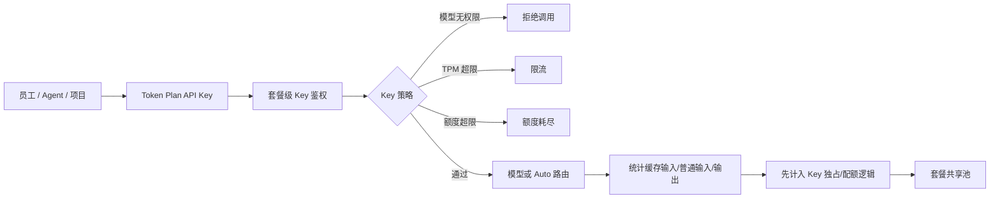

# 腾讯混元与 TokenHub 预付费套餐深度调研

> 调研日期：2026-07-21  
> 资料范围：腾讯云官方产品文档、API 文档及官方公告  
> 可信度标记：✅ 官方明确｜🔎 基于官方行为的架构推断｜❓公开文档未说明  
> 重要说明：腾讯旧“混元大模型平台”正在迁移到 TokenHub。本文严格区分旧平台资源包、TokenHub 个人版 Hy Token Plan、TokenHub 企业版 Token Plan，避免把三套生命周期和 API Key 机制混为一谈。
> 企业版的专项商业模式、状态机、管控 API 与成本分析，另见《腾讯 TokenHub Token Plan 企业版深度调研》文件。

---

## 一、执行摘要

### 1.1 最重要的六个结论

1. **旧混元 Token 预付费资源包已不适合作为新增采购方案。** 官方迁移指南说明旧混元能力逐步迁往 TokenHub，原平台不再新增模型能力并停止支持新购模型服务；存量资源包可继续使用、迁移或按规则申请退费。
2. **当前真正以腾讯混元 Hy3 为核心的预付费套餐是个人版 Hy Token Plan。** 价格为 28～468 元/月，所有输入、输出和缓存命中 Token 均按 1:1 从 Token 池扣减，但明确禁止自动化脚本、应用后端和批量 API。
3. **TokenHub 企业版不是“腾讯混元专属企业包”。** 企业版专业套餐目前支持 Auto、GLM、Kimi、MiniMax、DeepSeek 等模型，公开模型表没有 Hy3；轻享套餐只开放 Auto 智能路由，官方也没有承诺 Auto 一定路由到混元。
4. **企业版比阿里云坐席制更接近原生多租户 API 管理。** 它允许一个账号购买多个独立套餐，每套餐创建多个 API Key，并对每个 Key 设置模型白名单、独占额度、总额度上限和 TPM。
5. **企业版额度与 API Key 生命周期强绑定套餐。** 套餐到期后 Key 立即失效，未用额度不结转；不支持降配和退订。额度耗尽应按停用设计，不能假设自动切换后付费。
6. **专业版“积分”不是固定 Token。** 100 积分售价 1 元，各模型按缓存命中输入、普通输入、输出分别设置抵扣单价；模型组合、输出比例和缓存命中率会显著改变真实可用 Token 数。

### 1.2 产品地图

| 产品 | 当前定位 | 是否可作为新增选型 | 计量单位 | API Key 模型 |
|---|---|---:|---|---|
| 旧腾讯混元预付费资源包 | 存量产品，迁往 TokenHub | ❌ 不建议 | 按具体 SKU 的 Token/次数 | 凭证与资源包解耦，主账号独立创建 Key |
| TokenHub 个人版 Hy Token Plan | 个人交互式 Agent/编程工具 | ✅ 个人场景 | Token 池，1:1 抵扣 | 个人版套餐共用一个 Key |
| TokenHub 企业版专业套餐 | 企业多模型 API 配额管理 | ✅ 企业场景 | 积分池，按模型系数抵扣 | 套餐下可创建多 Key |
| TokenHub 企业版轻享套餐 | 企业低复杂度 Auto 路由 | ✅ 轻量企业场景 | Token 池，1:1 抵扣 | 套餐下可创建多 Key |
| TokenHub 后付费在线推理 | 通用生产 API | ✅ 后端生产场景 | 输入/输出/缓存分别按量 | 在线推理服务 Key，与 Token Plan 分开管理 |

---

## 二、产品代际：旧混元资源包正在退出新增采购

### 2.1 官方迁移状态

旧“腾讯混元大模型平台”文档已明确提示：相关功能逐步迁移至 TokenHub，迁移后原平台不再新增模型能力并停止支持新购模型服务，已购买服务暂时继续可用。TokenHub 迁移指南进一步说明，新平台不再支持旧式 Token 预付费资源包购买，存量客户可按迁移安排使用或申请退费。

这意味着采购判断应当是：

```text
已有旧资源包 → 评估消耗完、迁移或退费
新增采购     → 直接评估 TokenHub 套餐或后付费在线推理
```

### 2.2 旧资源包生命周期

| 事项 | 官方结论 |
|---|---|
| 抵扣生效边界 | 只能抵扣购买之后产生的调用量，不能追溯抵扣历史调用 |
| 后付费兜底 | 后付费为独立开关，需管理员主动开启；不能假设资源包耗尽后无条件自动按量 |
| 退款 | 主动新购且完全未使用的资源包，发货成功后 7 天内可申请全额退款；发生任何消耗后不满足该规则 |
| 资源包与 Key | 文档没有绑定步骤；资源包是账号计费权益，Key 是独立访问凭证 |
| 多包叠加与顺序 | ❓通用文档未说明 |
| 通用有效期 | ❓需按具体 SKU 购买页核验，不能把生图规则外推到生文 |
| 耗尽且未开后付费 | ❓精确错误码和停服行为未公开 |

### 2.3 旧平台凭证与限流架构

旧混元存在两类调用凭证：

- 腾讯云原生 API 使用 CAM `SecretId/SecretKey` 和 TC3-HMAC-SHA256 签名；
- OpenAI 兼容接口使用主账号在混元控制台独立创建的 Bearer API Key。

API Key 并不是购买资源包时自动生成，也不与某个资源包一一绑定。OpenAI 兼容 Key 只能由主账号创建和删除。官方同时明确，混元生文兼容接口默认并发由主子账号共享。因此，多 Key、多 CAM 子账号不等于多份独立吞吐。

```text
CAM 子账号 A / API Key A ─┐
CAM 子账号 B / API Key B ─┼→ 主账号共享资源包与接口并发
CAM 子账号 C / API Key C ─┘
```

旧方案适合账号内共享采购，但不具备文档可证实的 Key 级独立额度、模型白名单或原生下游分账能力。

---

## 三、个人版 Hy Token Plan：当前纯混元预付费路径

### 3.1 套餐价格

| 档位 | 月 Token 数 | 月价 | 折算价（元/百万 Token） |
|---|---:|---:|---:|
| Lite | 3,500 万 | ¥28 | 约 0.800 |
| Standard | 1 亿 | ¥78 | 0.780 |
| Pro | 3.2 亿 | ¥238 | 约 0.744 |
| Max | 6.5 亿 | ¥468 | 0.720 |

可用模型为 Hy3 和 Hy3 preview。各档模型范围相同，差别主要是月额度和动态速率等级。

### 3.2 抵扣机制

Hy Token Plan 不区分 Token 类型的抵扣系数：

```text
缓存命中输入 Token：1 Token 扣 1 Token
普通输入 Token：    1 Token 扣 1 Token
输出 Token：        1 Token 扣 1 Token
```

这与后付费的输入/输出/缓存差异定价完全不同。后付费 Hy3 当前刊例价为输入 1 元、输出 4 元、缓存命中 0.25 元/百万 Token；Hy3 preview 还会按上下文长度分段定价。因此：

- 输出比例高的 Agent 工作流，套餐的统一抵扣通常更有优势；
- 缓存命中率极高、输出很少的场景，后付费可能并不比套餐贵；
- 不能只比较“每百万 Token 单价”，必须代入真实输入/输出/缓存结构。

### 3.3 生命周期与限制

| 项目 | 规则 |
|---|---|
| 周期 | 从购买时刻起按月计算 |
| 未用额度 | 当期结束清零，不结转 |
| 额度耗尽 | 不自动转后付费，调用失败；升级或等待下一周期 |
| 升配 | 补差价，Key 不变、到期日不变；剩余额度 = 新档总额 - 本周期已用额 |
| 降配 | 不支持 |
| 退订 | 不支持 |
| 续费 | 到期前续费；到期后套餐与 Key 失效 |
| 限购 | 同一主账号及其子账号同一系列只可持有一个档位 |
| Key | 个人版通用 Token Plan 与 Hy Token Plan 共用一个 API Key，额度与有效期分别管理 |

### 3.4 最大商业限制

Hy Token Plan 是个人专享的交互式工具套餐，明确禁止：

- 自动化脚本；
- 自定义应用后端；
- 非交互式批量 API；
- 多人共享账号或 Key。

因此它虽然单价很低，但不能被用于企业 SaaS 后端或大规模自动化 Agent。把它当成便宜的生产 API 资源包会产生封禁和连续性风险。

---

## 四、TokenHub 企业版专业套餐

### 4.1 商业模式

```text
腾讯云账号
  ├─ 套餐 A：研发部门积分池 + 多 API Key
  ├─ 套餐 B：客服部门积分池 + 多 API Key
  └─ 套餐 C：项目客户积分池 + 多 API Key
```

一个腾讯云账号可购买多个相互独立的套餐。每个套餐有独立积分池、API Key 配额和到期时间，适合按部门、项目或业务线采购。

| 项目 | 规则 |
|---|---|
| 价格 | 100 积分 = ¥1 |
| 最低规格 | 10 万积分，即 ¥1,000/月 |
| 购买时长 | 1～12 个月 |
| 生效 | 购买开通后立即生效 |
| Key 数量 | 每 1 万积分可创建 1 个 Key；最低套餐理论上 10 个 Key |
| 套餐额度 | 同一套餐下所有 Key 共享总积分池 |

积分没有现金属性，不可跨账号交易、兑换其他产品或折现退还。

### 4.2 Key 级配额能力

每个 API Key 可以独立配置：

1. **模型白名单**：限定 Key 可调用哪些模型；
2. **独占额度**：从套餐池预留给该 Key，其他 Key 无法抢占；
3. **总额度上限**：该 Key 在本周期最多可消耗的“独占 + 共享”总量；
4. **TPM 上限**：限制该 Key 每分钟最大 Token 数，不超过套餐级 TPM；
5. **名称与归属**：支持按员工、Bot、项目命名；
6. **批量创建**：单次可创建 1～10 个同配置 Key。

额度关系可表示为：

```text
套餐总积分池 = Σ Key 独占额度 + 共享积分池

Key 可用额度 = Key 剩余独占额度
             + min(共享池剩余额度, Key 总额度上限剩余量)
```

未配置独占额度时，多个 Key 对共享池先到先得。仅设置“总额度上限”可以防止单 Key 无限消费，但不能保证该 Key 一定拿得到额度；若需要最低保障，必须同时设置独占额度。

### 4.3 模型积分抵扣表

实际扣减公式：

```text
扣减积分 = 命中缓存输入 Token × 缓存单价
         + 未命中输入 Token × 输入单价
         + 输出 Token × 输出单价
```

以下单位均为“积分/百万 Token”，价格和模型清单会动态调整：

| 模型 | 阶梯 | 缓存命中输入 | 普通输入 | 输出 |
|---|---|---:|---:|---:|
| GLM-5.2 | — | 200 | 800 | 2,800 |
| GLM-5 | <32k | 100 | 400 | 1,800 |
| GLM-5 | ≥32k | 150 | 600 | 2,200 |
| GLM-5.1 | <32k | 130 | 600 | 2,400 |
| GLM-5.1 | ≥32k | 200 | 800 | 2,800 |
| GLM-5-Turbo | <32k | 120 | 500 | 2,200 |
| GLM-5-Turbo | ≥32k | 180 | 700 | 2,600 |
| Kimi K2.7 Code | — | 130 | 650 | 2,700 |
| Kimi K2.7 Code HighSpeed | — | 260 | 1,300 | 5,400 |
| Kimi-K2.6 | — | 110 | 650 | 2,700 |
| MiniMax-M2.7 | — | 42 | 210 | 840 |
| MiniMax-M3 | <512k | 42 | 210 | 840 |
| MiniMax-M3 | ≥512k | 84 | 420 | 1,680 |
| DeepSeek-V4-Flash | — | 20 | 100 | 200 |
| DeepSeek-V4-Pro | — | 100 | 1,200 | 2,400 |
| DeepSeek-V4-Flash 原厂直供 | — | 2 | 100 | 200 |
| DeepSeek-V4-Pro 原厂直供 | — | 2.5 | 300 | 600 |
| Auto 智能路由 | — | 50 | 324 | 1,596 |

换算成人民币时：100 积分 = 1 元。例如 DeepSeek-V4-Flash 普通输入 100 积分/百万 Token，相当于 1 元/百万 Token；输出 200 积分相当于 2 元/百万 Token。

### 4.4 “预算可买多少 Token”不能固定承诺

腾讯云给出的综合单价估算基于历史输入输出比和缓存命中率，只适合预算参考。真实消耗受以下因素共同决定：

- 模型组合；
- 上下文长度阶梯；
- 输入与输出比例；
- 缓存命中率；
- Auto 路由实际选中的模型；
- 模型价格和模型库动态变化。

企业应基于自己的流量日志计算：

```text
综合积分单价 = 缓存输入占比 × 缓存价
             + 普通输入占比 × 普通输入价
             + 输出占比 × 输出价
```

### 4.5 生命周期

| 操作 | 行为 |
|---|---|
| 升配 | 支持补差价；Key 和到期日不变；新剩余额度 = 升级后总额 - 已用额 |
| 降配 | 不支持 |
| 退订 | 一经购买不支持退订 |
| 续费 | 必须在到期前完成；当前周期用尽后，续费不会提前释放下一周期额度 |
| 到期 | 剩余积分不结转，套餐失效，套餐下 API Key 立即失效 |
| Key 配置修改 | 每个 Key 每日最多修改 10 次 |
| 模型持续性 | 模型库动态更新，不承诺任一模型永久可用 |

DeepSeek“原厂直供”模型由 DeepSeek 直接提供，TokenHub 明确不为其提供 SLA 保障，这是生产选型必须单独接受的供应链风险。

---

## 五、TokenHub 企业版轻享套餐

### 5.1 商业模式

| 项目 | 规则 |
|---|---|
| 计量 | 购买月度 Token 池，所有 Token 1:1 扣减 |
| 刊例价 | ¥2/百万 Token |
| 最低规格 | 5,000 万 Token，约 ¥100/月 |
| 购买规格 | 最低 5,000 万 Token；更高规格与步进以控制台为准 |
| 模型 | 仅 Auto 智能路由 |
| Key 数量 | 每 5,000 万 Token 可创建 1 个 Key |
| 购买时长 | 1～12 个月 |

轻享套餐不区分缓存、普通输入和输出：

```text
实际请求产生 1 Token → Token 池扣 1 Token
```

它以“模型选择权”换取预算简单性：团队无需理解每个模型的积分换算，但无法指定 GLM、Kimi、MiniMax 或混元等底层模型，只能调用 `auto`。

### 5.2 与专业套餐对比

| 维度 | 专业套餐 | 轻享套餐 |
|---|---|---|
| 最低月费 | ¥1,000 | 约 ¥100 |
| 额度单位 | 积分 | Token |
| 抵扣 | 按模型、缓存、输入、输出差异系数 | 所有 Token 1:1 |
| 模型选择 | 多模型白名单 | 仅 Auto |
| Key 独占额度 | 支持 | 支持 |
| Key 总上限 | 支持 | 支持 |
| Key TPM | 支持 | 支持 |
| 成本预测 | 取决于流量结构 | 简单、线性 |
| 模型可控性 | 高 | 低 |

### 5.3 生命周期

轻享套餐同样购买即生效、按月刷新、余额不结转、到期 Key 失效，不支持降配和退订。额度耗尽后的公开文档没有描述后付费兜底，应按服务停止或请求被拒绝设计，并通过测试或工单确认具体错误码。

---

## 六、API Key 与调用链路架构

### 6.1 新企业版不是坐席制

TokenHub 企业版的数据关系是：

```text
腾讯云账号
  └─ Token Plan 套餐（TeamId / 独立额度池）
       ├─ API Key A：模型白名单 + 独占额度 + 总上限 + TPM
       ├─ API Key B：模型白名单 + 独占额度 + 总上限 + TPM
       └─ API Key C：模型白名单 + 独占额度 + 总上限 + TPM
```

它没有阿里云 Token Plan 那种“先创建成员、分配坐席、系统随坐席生成 Key”的强绑定。腾讯方案是购买套餐后，由管理员主动创建一个或多个 API Key，并直接配置 Key 的额度与速率。

### 6.2 调用链路



### 6.3 与 TokenHub 全局 Key 隔离

官方管控面 API 明确指出，Token Plan 的 Key 和用量在套餐中单独管理，不能通过 TokenHub 全局接口查询和使用。工程侧需要把以下两种凭证当作不同资源类型：

- TokenHub 后付费在线推理 Key；
- Token Plan 套餐 Key。

它们的 Base URL、配额来源、用量接口和生命周期均可能不同，不能只用一个通用 `provider_api_key` 字段而不记录套餐类型和套餐 ID。

建议内部凭证模型至少包含：

```text
provider
product_type              # tokenhub_postpaid / tokenplan_enterprise / legacy_hunyuan
team_id                   # Token Plan 套餐 ID
api_key_id
credential_secret_ref
allowed_models
exclusive_quota
quota_limit
tpm_limit
valid_from / expire_at
status
```

### 6.4 分账能力判断

企业版提供的是真正可用的内部成本归因基础：

- 多个套餐可按部门/项目建立硬额度池；
- 套餐内多个 Key 可按员工、Bot、客户分配；
- Key 级独占额度提供最低保障；
- Key 级总额度上限控制最大成本；
- Key 级 TPM 抑制噪声邻居。

但它仍不是面向下游客户的完整开票系统。对 SaaS 客户分账仍需代理层记录租户、请求、模型和 Token 明细，并生成内部账单。

---

## 七、与阿里云 Token Plan 的关键差异

| 维度 | 腾讯 TokenHub 企业版 | 阿里云百炼 Token Plan 团队版 |
|---|---|---|
| 核心商业单元 | 套餐积分池/Token 池 | 坐席 |
| 成员系统 | 无需先创建成员 | 成员是坐席分配对象 |
| Key 生成 | 管理员主动创建，可多 Key | 分配坐席时系统生成，一成员一 Key |
| 额度隔离 | 套餐独立；Key 可设独占额度与上限 | 坐席额度独立，另有共享包 |
| Key 模型白名单 | 专业版支持 | 未见同等 Key 级能力 |
| Key TPM | 支持独立设置 | 限流主要按主账号聚合 |
| 多业务线隔离 | 同账号可购多个独立套餐 | 同账号一个订阅内按坐席管理 |
| 到期影响 | 套餐下全部 Key 失效 | 对应坐席 Key 失效 |
| 降配/退订 | 企业版不支持 | 阿里云支持的退订条件另行约束 |
| 使用场景 | 文档包含工具/应用/服务立即无法调用的表述 | 明确限制为兼容工具交互式使用，不可用于应用后端 |

腾讯方案更接近“企业 API 配额平台”，阿里云方案更接近“人员席位订阅”。如果目标是对部门、项目、Bot 或下游租户做技术配额，腾讯的套餐 + 多 Key 模型更自然；如果目标是把订阅直接绑定员工，阿里云坐席模型更直观。

---

## 八、主要风险与隐性限制

### 8.1 产品命名风险

“腾讯混元预付费套餐”至少可能指三种不同产品。采购、合同和技术设计必须写明产品 ID：旧混元资源包、Hy Token Plan 个人版，还是 TokenHub 企业版。

### 8.2 企业版不等于混元企业包

当前企业专业套餐公开模型表没有 Hy3，轻享套餐只承诺 Auto。若必须使用腾讯自研混元并用于生产后端，应优先评估 TokenHub Hy3 后付费或向腾讯云确认企业预付费路线，不能假设企业 Token Plan 自动包含混元。

### 8.3 无降配、无退订、月末清零

购买后需求下降没有灵活退出机制。建议首月采用较小规格，用真实工作负载压测后再升配；不要一次购买 12 个月的大额度而没有消耗基线。

### 8.4 模型库动态变化

官方明确不承诺某个模型永久可用，已有模型也存在明确下线日期。应用必须支持模型配置热更新、兼容性测试和降级路由。

### 8.5 Auto 的不可解释成本与质量

轻享版虽然每 Token 成本固定，但底层模型选择不可控；质量、延迟、上下文能力和供应商可能随路由变化。对需要模型审计或固定评测结果的业务不宜只依赖 Auto。

### 8.6 额度耗尽无明确后付费兜底

企业 Token Plan 文档没有给出超额自动切后付费的承诺，数据结构存在 `EXHAUSTED` 停止原因。生产架构应在 70%、85%、95% 设置告警，并准备升配或备用后付费路由。

---

## 九、选型建议

| 场景 | 建议 |
|---|---|
| 个人使用 Hy3 编程/Agent 工具 | Hy Token Plan；按真实月用量选择档位 |
| 企业希望低成本给多个团队分配 API Key | TokenHub 企业轻享；接受仅 Auto 与模型不可控 |
| 企业需要按 Key 控模型、额度和 TPM | TokenHub 企业专业套餐 |
| 必须固定使用腾讯混元 Hy3 的生产后端 | TokenHub Hy3 后付费在线推理，或向商务确认企业预付费支持计划 |
| 已持有旧混元预付费资源包 | 评估用完、迁移或退费，不再围绕旧平台新增架构 |
| SaaS 下游客户分账 | 企业套餐作为上游池，自建网关、租户账本和开票系统 |

### 9.1 企业采购前必须完成的验证

1. 用真实流量回放测出输入、输出、缓存命中比例；
2. 确认目标模型在套餐购买页当前仍可用；
3. 实测额度耗尽的 HTTP 状态码、错误体和恢复行为；
4. 验证 Key 独占额度、共享池和总上限的扣减先后；
5. 压测 Key TPM 与套餐级总 TPM 的聚合关系；
6. 确认续费、升配后 API Key 是否保持不变；
7. 针对模型下线建立替代模型和回归评测；
8. 明确 DeepSeek 原厂直供无 TokenHub SLA 的风险接受人。

---

## 十、待腾讯云商务或工单确认的问题

1. 企业专业套餐何时支持 Hy3/Hy3 preview，或是否存在未公开的混元企业专属 SKU？
2. 轻享 Auto 路由是否可能选择混元模型，是否能查询每次请求实际路由模型？
3. 企业套餐额度耗尽时的具体 HTTP 错误码，是否可配置后付费兜底？
4. 套餐级 TPM 的具体值及其与多个 Key TPM 的聚合算法？
5. 独占额度和共享额度在一次请求中的精确扣减顺序？
6. 续费、升配以及过期后重新开通时，原 API Key 是否在所有情况下保持不变？
7. API Key 删除、禁用和轮换是否提供宽限期或双 Key 并行窗口？
8. Key 级调用明细的保存周期、导出粒度与 API 查询频率限制？
9. 轻享套餐的最大 Token 规格和购买步进是多少，后续是否会动态调整？
10. 企业套餐是否允许用于对外 SaaS 服务，具体转售和二次分发边界是什么？

---

## 十一、官方资料索引

- [TokenHub Token Plan 企业版概述](https://cloud.tencent.com/document/product/1823/131172)
- [企业版专业套餐与积分抵扣表](https://cloud.tencent.com/document/product/1823/130659)
- [企业版轻享套餐](https://cloud.tencent.com/document/product/1823/131173)
- [企业版快速入门与 API Key 配置](https://cloud.tencent.com/document/product/1823/130660)
- [企业版操作指南](https://cloud.tencent.com/document/product/1823/130661)
- [Token Plan 管控面 API 简介](https://cloud.tencent.com/document/product/1823/132280)
- [查询 Token Plan 套餐详情 API](https://cloud.tencent.com/document/product/1823/132270)
- [修改 Token Plan API Key 配置 API](https://cloud.tencent.com/document/product/1823/132273)
- [Hy Token Plan 个人版](https://cloud.tencent.com/document/product/1823/130060)
- [Token Plan 个人版 FAQ](https://cloud.tencent.com/document/product/1823/130076)
- [TokenHub 模型后付费价格](https://cloud.tencent.com/document/product/1823/130055)
- [TokenHub 迁移指南](https://cloud.tencent.com/document/product/1823/131382)
- [旧混元购买方式](https://cloud.tencent.com/document/product/1729/106126)
- [旧混元退费说明](https://cloud.tencent.com/document/product/1729/106128)
- [旧混元 OpenAI 兼容 API Key 管理](https://cloud.tencent.com/document/product/1729/111008)
- [旧混元 OpenAI 兼容接口](https://cloud.tencent.com/document/product/1729/111007)
- [旧混元腾讯云原生 API 鉴权](https://cloud.tencent.com/document/product/1729/101841)
